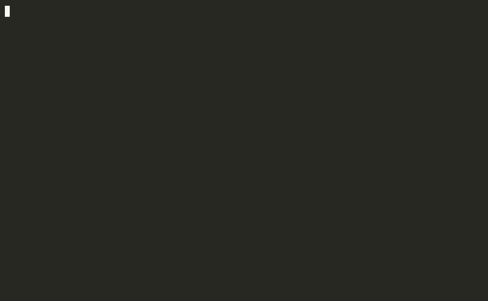

<div align="center">

# ⛓️ zerochain

### Build AI Agents with `mkdir`

[](https://www.rust-lang.org/)
[](https://opensource.org/licenses/MIT)
[]()

**Multi-agent orchestration using the filesystem.**  
Directories are stages. Files are state. Symlinks are data flow.

[⚡ Quick Start](#-quick-start) · [✨ Highlights](#-highlights) · [🖥️ CLI](#-cli) · [🌐 HTTP API](#-container-zerochaind) · [🕸️ Contribution Graph](#️-collective-contribution-graph) · [🧰 LLM Tools](#-llm-tools) · [🏗️ Architecture](#️-architecture)

</div>

---

## 🎯 In One Sentence

> Zerochain implements multi-agent AI workflows as files and folders — no databases, no brokers, no network stacks. Just the filesystem, content-addressed storage, and async Rust.

---

## ✨ Highlights

| | |
|---|---|
| **📁 Filesystem-native** | No databases needed. Directories are stages, files are state. CLI or HTTP daemon. |
| **🔒 Content-addressed** | Blake3 hashing. Every artifact identified by its content hash. |
| **💥 Crash-safe** | Atomic writes, PID-based stale lock detection, automatic recovery. |
| **🎯 Deterministic LLM** | Config derived from content hash. Same input, same execution. |
| **🔌 Provider-agnostic** | Any OpenAI-compatible API — OpenAI, Ollama, Moonshot, and more. |
| **🦀 Zero unsafe** | Pure safe Rust. Async I/O with tokio. Every fallible op returns `Result`. |
| **🏛️ Auditable** | Because state is files, every mutation is a file operation. Layer jj underneath and you get an immutable, queryable audit trail for free — with `jj op log`, `jj undo`, and zero extra infrastructure. |
| **🕸️ Collective memory** | Workspace-level, append-only contribution graph. Every run chains to prior runs, verifications supersede, and everything is content-addressed and auditable through the same jj trail. |
| **🧬 Lua stage scripts** | Optional: configure a stage with `CONTEXT.lua` instead of YAML frontmatter, and run sandboxed `on_validate`/`on_complete` hooks — e.g. skip a stage dynamically based on upstream output. |

---

## ⚡ Quick Start

```bash
# Install (requires Rust nightly 1.90+)
# Recommended: clone with jj to see the audit-trail philosophy in action
jj git clone https://github.com/awdemos/zerochain.git
cd zerochain

# Or clone with git (jj works on top of Git — you can add it later)
# git clone --depth 1 https://github.com/awdemos/zerochain.git
# cd zerochain

cargo build --release --workspace

# Configure
export OPENAI_API_KEY="sk-..."

# Create and run a workflow
zerochain init --name my-task
zerochain run my-task
```

That's it. zerochain creates a stage directory, calls the LLM, and writes the result to `output/result.md`.

---

## 🎬 Demo

Typical CLI workflow: help → init → inspect prompt → run → read result → status → list.



---

## 🖥️ CLI

```bash
# Initialize a workflow from a Backlog.md task
zerochain init --name my-task --path ./backlog.md

# Run the next pending stage
zerochain run my-task

# Run a specific stage
zerochain run my-task --stage 02_design

# Check workflow status
zerochain status my-task

# List all workflows
zerochain list

# Approve a stage waiting for human review
zerochain approve my-task 03_review
```

---

## 🌐 Container (zerochaind)

Run zerochain as a stateless HTTP daemon with full audit trails via jj:

```bash
# Build locally
docker build -t zerochaind .
docker run -d \
  -p 8080:8080 \
  -e OPENAI_API_KEY="sk-..." \
  -v zerochain-data:/workspace \
  zerochaind

# Or build and push to a registry with Dagger
dagger call publish --registry ttl.sh/$USER-zerochaind:1h
```

| Method | Endpoint | Description |
|--------|----------|-------------|
| `POST` | `/v1/workflows` | Initialize workflow |
| `POST` | `/v1/workflows/{id}/run` | Run next pending stage |
| `GET` | `/v1/workflows/{id}` | Workflow status |
| `GET` | `/v1/workflows/{id}/output/{stage}` | Read result |
| `GET` | `/v1/workflows/{id}/subvolumes` | List Btrfs subvolumes (Btrfs-only) |
| `GET` | `/v1/workflows/{id}/export-okf?output=<dir>` | Export workflow as OKF v0.2 bundle |
| `GET` | `/v1/graph` | Query the collective contribution graph (views, tags, actors, metric filters) |
| `POST` | `/v1/graph/contributions` | Publish a contribution (`setup`/`result`/`insight`/`hypothesis`/`report`) |
| `POST` | `/v1/graph/verifications` | Publish a reproduction verdict against a target contribution |

### 🔍 Audit Trails

Because zerochaind is filesystem-native, every workflow mutation is a file operation. `jj op log` gives you a complete, immutable timeline of every operation — no audit database, no extra infrastructure. The VCS *is* the audit log. We use the same jj workflow to develop ZeroChain itself; see [CONTRIBUTING.md](./CONTRIBUTING.md).

---

## 📦 Open Knowledge Format (OKF) v0.2

zerochain emits self-describing knowledge concepts for every stage output. Each `output/result.md` now includes YAML frontmatter (`type`, `generated`, `status`) so downstream tools can trace provenance without parsing zerochain internals.

```bash
# Export a completed workflow as a portable OKF bundle
zerochain export-okf my-task --output ./my-task-okf
```

The bundle contains:
- `index.md` — workflow-level OKF concept with a stage manifest
- `concepts/*.md` — each stage's `output/result.md` (already OKF-wrapped)
- `log.md` — human-readable stage status log

Override the default actor string (`zerochain/<version>`) with:

```bash
export ZEROCHAIN_OKF_ACTOR="my-org/1.0"
```

---

## 🕸️ Collective Contribution Graph

zerochain keeps a workspace-level, append-only graph of typed contributions so workflows build on past runs instead of starting from scratch — shared memory in the spirit of *[Agora: Git as Shared Memory for Collective AutoResearch](https://arxiv.org/abs/2609.18094)* (Zhang et al., NVIDIA, 2026), implemented as files. Every workflow init publishes a `setup` node; stages with `index_output: true` publish `result` nodes chained to their lineage; agents publish `insight`/`hypothesis`/`verification` records via the `contribute`, `verify`, and `graph_query` tools (list them in a stage's `tools:` frontmatter).

Contributions are typed (`setup`, `result`, `insight`, `hypothesis`, `verification`, `report`), content-addressed as `c-<hash>` markdown under `.zerochain/graph/contributions/`, and linked by parent edges — every record names what it builds on, so any claim can be traced back to the exact artifact and lineage that produced it. A `verification` names exactly one target and a verdict (`confirmed`/`partial`/`failed`); each verifier's newest verdict supersedes their older ones at query time, and both stay in the history. Everything is auditable through the same jj trail as the rest of the workspace.

```bash
# Link a new workflow to prior contributions
zerochain init --name run-2 --parent c-9f3a21c7d4e8b601

# Human surfaces (actor recorded as human:$USER)
zerochain contribute --type insight --body "donor ensembling helps" --parent c-9f3a21c7d4e8b601
zerochain verify c-9f3a21c7d4e8b601 --verdict confirmed --body "reproduced on H100"
zerochain graph --view leaders        # recent | leaves | open_hypotheses | unverified | negative | leaders
```

The same graph is exposed over HTTP (`GET /v1/graph`, `POST /v1/graph/contributions`, `POST /v1/graph/verifications`) behind the daemon's bearer auth for non-Rust clients.

Stage outputs can carry a metric via CONTEXT.md frontmatter — `metric: {name: bpb, value: 1.899, direction: lower}` — which the engine attaches to the auto-captured `result` node, alongside content-addressed `b3:` artifact references.

---

## 🧊 Btrfs Stage Isolation

On Btrfs filesystems, zerochain can create each workflow and stage as an isolated subvolume. This enables true zero-copy snapshots and per-stage rollback.

```bash
# Workflow root is a subvolume; stages are plain directories inside it.
ZEROCHAIN_BTRFS_SUBVOLUME_MODE=workflow zerochaind

# Workflow root and every stage are independent subvolumes.
ZEROCHAIN_BTRFS_SUBVOLUME_MODE=stage zerochaind
```

The effective mode is persisted to `{workflow_root}/.subvolume-mode` when the workflow is created, so the workflow keeps its isolation semantics even if the environment variable changes later. Use `GET /v1/workflows/{id}/subvolumes` to inspect the subvolumes for a workflow.

---

## 🔄 Workflow Graphs and Loops

Zerochain now represents every workflow as an explicit execution graph. Stages are nodes and dataflow/ordering are edges. For the common case, the graph is still derived from `NN_name/` directory ordering, but the internal model is typed and testable.

### Why this matters

- **No hidden ordering rules.** Stage dependencies are explicit edges in `zerochain-core/src/graph.rs`, not side effects of directory names.
- **Loops.** A stage can be declared as a `Loop` node with a bounded body. Loops terminate when the body emits a control record.
- **Control records.** A stage ends a loop by writing one of these strings on the first line of `output/result.md`:
  - `zerochain.control.v1.return` — loop succeeds with the current iteration's output
  - `zerochain.control.v1.escalate` — loop stops and the workflow continues past it
  - `zerochain.control.v1.fail` — loop fails
  - `zerochain.control.v1.await` — loop pauses for human approval

### Using loops in a workflow

Loops are not exposed as a separate directory layout yet. They are constructed in code via the `WorkflowGraph` API. A typical loop looks like this:

```rust
use zerochain_core::graph::{WorkflowGraph, LoopExhaustion, ControlOutcome};
use zerochain_core::stage::StageId;

let mut graph = WorkflowGraph::new();
let body = graph.add_stage(StageId::parse("02_review").unwrap());
graph.add_loop(
    StageId::parse("03_review_loop").unwrap(),
    body,
    5,
    LoopExhaustion::Fail,
).unwrap();
```

When the `02_review` stage writes `zerochain.control.v1.return` as the first line of `output/result.md`, the loop ends. If it never returns within five iterations, the loop fails according to `LoopExhaustion::Fail`.

You can also build arbitrary directed acyclic graphs by adding stages and declaring dependencies explicitly:

```rust
let spec = graph.add_stage(StageId::parse("00_spec").unwrap());
let analyze = graph.add_stage(StageId::parse("01_analyze").unwrap());
graph.add_dependency(analyze, spec).unwrap();
```

The actor runtime (`zerochain-engine`) executes the graph while keeping zerochain's filesystem-native state, symlinks, and per-workflow actor model unchanged.

---

## 🧰 LLM Tools

Stages can be given tools — reusable capabilities the LLM may invoke mid-run, with results fed back into the conversation in a bounded tool loop. Enable them per stage in CONTEXT.md frontmatter:

```yaml
---
tools: [read_file, write_file, shell, contribute, verify, graph_query]
tool_loop_max_iterations: 8
---
```

| Tool | What it does |
|------|--------------|
| `read_file` / `write_file` | Read and write files inside the workflow workspace |
| `shell` | Run a shell command |
| `http` | Make an HTTP request |
| `memory_store` / `memory_query` | Store chunks and search vector memory semantically |
| `contribute` / `verify` / `graph_query` | Publish and query collective contribution graph records |

Tools are registered in `zerochain-tools`; the engine injects workflow context (workspace paths, graph lineage, actor) into every call.

---

## 🏗️ Architecture

**Content-addressed storage.** All artifacts stored by Blake3 hash. No filenames matter — content identity is the hash.

**Copy-on-write snapshots.** Each stage gets a CoW snapshot of the previous stage's output.

**Deterministic LLM config.** `LLMConfig::deterministic()` derives a Blake3 seed from the content CID for reproducible execution.

**What is an agent?** Zerochain does not define a separate `Agent` abstraction. In this codebase, an *agent* is a workflow **stage**: a directory (`NN_name/`) containing a `CONTEXT.md` prompt, an `input/` directory, and an `output/` directory. A multi-agent workflow is simply a pipeline of stages that pass state through the filesystem. Stages can also exchange messages across pods via the optional broker.

### Crate Structure

| Crate | Purpose |
|-------|---------|
| `zerochain-cas` | Blake3 content-addressed storage with atomic writes |
| `zerochain-fs` | Copy-on-write filesystem, advisory locks, Btrfs subvolumes |
| `zerochain-llm` | Provider-agnostic LLM backend with profiles |
| `zerochain-core` | Workflow/stage model, execution graph, Lua config, frontmatter (tools, metric), OKF |
| `zerochain-memory` | Vector memory and semantic search, plus the collective contribution graph (records, store, index, embeddings) |
| `zerochain-tools` | Tool registry with built-in file, shell, HTTP, memory, and graph tools |
| `zerochain-broker` | Message broker abstraction for cross-pod agent communication |
| `zerochain-error` | Shared error types for the workspace |
| `zerochain-daemon` | CLI binary (`zerochain`) |
| `zerochain-server` | HTTP daemon (zerochaind) |

---

## 🔀 Developed with jj

ZeroChain is developed with [jj](https://github.com/martinvonz/jj) — a version-control system that treats the working copy as a commit and gives you an immutable operation log. We dogfood the same workflow we recommend for audit trails:

```bash
# See what changed
jj diff

# Create a commit
jj describe -m "feat: add stage isolation"
jj new

# Review the operation log
jj op log
```

We use Git as the wire protocol (GitHub for issues, PRs, and CI), but jj as the local workflow. You don't need to give up GitHub to get the benefits of jj — they are fully compatible. See [CONTRIBUTING.md](./CONTRIBUTING.md) for the full workflow.

---

## 🔄 Local CI with Dagger

Zerochain uses Dagger for reproducible local CI — no GitHub Actions, no CI YAML drift. The `Makefile` wraps the Dagger module so you don't have to remember long CLI invocations.

```bash
# Run the full pipeline before pushing
make ci

# Individual steps
make lint
make test
make build
make docker
```

The underlying Dagger commands (if you prefer them raw):

```bash
# Run the full pipeline (lint, test, build)
dagger call all --source=. --progress=plain

# Individual steps
dagger call lint --source=. --progress=plain
dagger call test --source=. --progress=plain
dagger call build --source=.

# Build the zerochaind container image
dagger call docker --source=. -o zerochaind-image.tar
```

The module mounts cargo cache volumes for incremental builds, so repeated runs are fast. Same source, same pipeline, anywhere Dagger runs.

---

## 🗺️ Roadmap

- [ ] Chainguard container execution for stage isolation
- [x] Btrfs copy-on-write snapshots (zero-copy isolation)
- [ ] OpenCode TypeScript plugin
- [x] Dagger CI module
- [x] Template registry for common workflow patterns
- [x] Collective contribution graph (Agora-style shared memory)

---

<div align="center">

**© 2026 Andrew White · MIT License**

</div>
